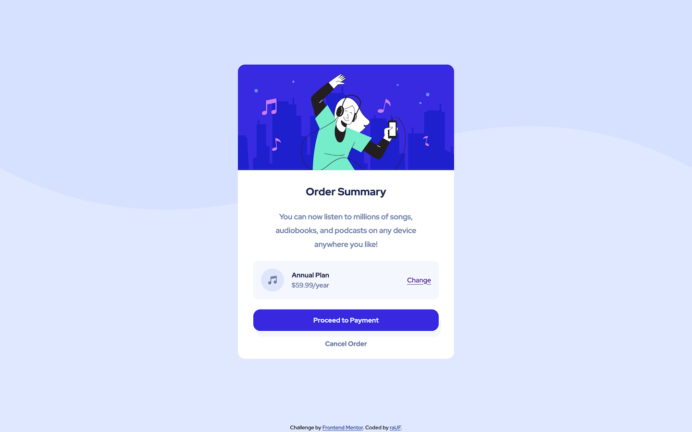

# Frontend Mentor - Order Summary Component

This is a solution to the [Order summary card challenge on Frontend Mentor](https://www.frontendmentor.io/challenges/order-summary-component-QlPmajDUj).

## Table of contents

  - [Overview](#overview)
  - [Screenshot](#screenshot)
  - [Links](#links)
  - [Built with](#built-with)
  - [Author](#author)

## Overview
Component with different backgrounds for mobile and desktop views.

## Screenshot

| Mobile                                                                                | Desktop                                                                                 |
| ------------------------------------------------------------------------------------- | --------------------------------------------------------------------------------------- |
|  |  |

## Links

- Live Site URL: [https://rauf-dev.github.io/fm_order-summary-component/](https://rauf-dev.github.io/fm_order-summary-component/)

## Built with

- Semantic HTML5 markup
- CSS custom properties
- Flexbox
- Mobile-first workflow

## Author

- Website - [raUF!](https://www.heyrauf.com)
- Frontend Mentor - [@raUF!](https://www.frontendmentor.io/profile/yourusername)

